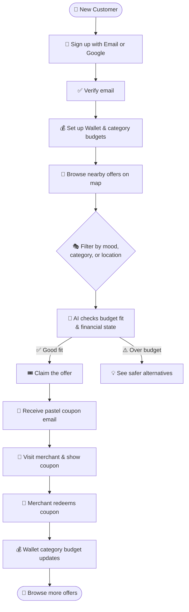
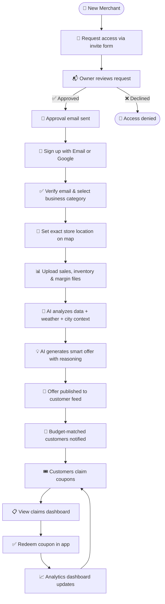

<div align="center">

# 🏙️ Localyse

### AI-Powered Finance-Aware City Wallet

<br/>

[](https://github.com)
[](https://vercel.com)
[](./LICENSE)

<br/>

[](https://reactjs.org/)
[](https://www.typescriptlang.org/)
[](https://vitejs.dev/)
[](https://tailwindcss.com/)
[](https://nodejs.org/)
[](https://expressjs.com/)
[](https://mongodb.com/)

<br/>

> ### ✨ *"Is this deal right for this person, in this place, at this time, with this budget?"*

<br/>

</div>

---

## 🌆 What is Localyse?

**Localyse** is an AI-powered, finance-aware city wallet that bridges the gap between local merchants and budget-conscious customers. It's not just another coupon app — it's a **proactive financial advisor for local city commerce**.

```
🛍️  Merchants  →  upload business data  →  AI generates smart offers
👛  Customers  →  get budget-aware recs  →  claim & redeem locally
🤖  AI Engine  →  weather + mood + wallet  →  perfect deal at perfect time
```

---

## 💡 The Problem We Solve

| Other offer apps ask... | Localyse asks... |
|---|---|
| ❓ Is this deal attractive? | ✅ Is this deal right for **this person**? |
| ❓ Is this popular nearby? | ✅ Is this the right **time and place**? |
| ❓ Is it a discount? | ✅ Does this fit their **actual budget**? |

---

## ✨ Features at a Glance

<details>
<summary><b>👛 Customer App</b></summary>
<br/>

| Feature | Description |
|---|---|
| 📍 Live Offer Feed | Personalized offers based on your location & time |
| 🗺️ Nearby Map | Filter offers by distance on an interactive map |
| 😊 Mood-Based Picks | "For You" recommendations tuned to how you feel |
| 💰 Personal Wallet | Set USD budgets per spending category |
| 📊 Budget Tracker | See exactly how much you have left before you spend |
| 🎟️ Smart Coupons | Claim, receive via email, and redeem at the store |
| 🔁 Redemption History | Track every deal you've used |
| 🔐 Auth | Email + password, **Google Sign-In**, email verification, **forgot / reset password** |

</details>

<details>
<summary><b>🏪 Merchant App</b></summary>
<br/>

| Feature | Description |
|---|---|
| ✉️ Invite-only onboarding | New merchants **request access**; owner approves before sign-up (email or Google) |
| 🎀 Admin approval | Email to platform owner with **one-tap Approve / Decline**; optional API with `MERCHANT_ADMIN_KEY` |
| 🤖 AI Offer Generator | Upload your sales/inventory files — AI does the rest |
| 📌 Geo-Pinning | Set your exact store location on a map |
| 💳 Offer Cards | Show actual price vs. after-offer price clearly |
| 👤 Coupon Claims Page | View customer name, email, coupon code & redeem |
| 📈 Analytics Dashboard | Track offer performance in real-time |
| 📧 Budget-Fit Emails | Notify customers when a new offer fits their wallet |
| 🔐 Auth | Email + password, **Google Sign-In**, email verification, **forgot / reset password** |

</details>

<details>
<summary><b>🧠 AI & Intelligence</b></summary>
<br/>

- ⚡ **Groq** — Merges spreadsheet rollups, Tavily, and weather into structured offer synthesis
- 🔍 **Tavily API** — Real-time contextual web insights for city & category context
- 📊 **Spreadsheet Analytics** — XLSX parsing with revenue, margin & inventory rollups
- 🌦️ **Weather-aware reasoning** — Offers shift based on current conditions
- 🚦 **Financial state detection** — `overspending` · `at_risk` · `balanced` · `under_budget`
- 🔮 **Offer impact simulation** — Budget effect previewed before recommendation is shown
- 💬 **Personalized explanations** — AI tells you *why* a deal is right for you

</details>

---

## 🛠️ Tech Stack

### 🎨 Frontend

| Tech | Purpose |
|---|---|
| ⚛️ React + TypeScript | UI framework with type safety |
| ⚡ Vite | Lightning-fast build tool |
| 🎨 Tailwind CSS | Utility-first styling |
| 🔀 React Router | Client-side routing |
| 🔑 Google Sign-In | OAuth authentication |

### ⚙️ Backend

| Tech | Purpose |
|---|---|
| 🟢 Node.js + Express | API server & runtime |
| 🍃 MongoDB + Mongoose | Database & ODM |
| 🤖 Groq API | AI offer synthesis |
| 🔍 Tavily API | Live web search & context |
| 📊 XLSX + Multer | File parsing & uploads |
| 📧 Nodemailer | Email workflows |

### ☁️ Deployment

| Tech | Purpose |
|---|---|
| ▲ Vercel | Frontend + serverless API |
| 🌍 MongoDB Atlas | Cloud database |
| 🗺️ Geoapify | Maps & geocoding |

---

## 📁 Project Structure

```
Hackathon/
├── 📁 api/                    # Vercel serverless Express adapter
├── 📁 backend/                # Express API, models, controllers, services
│   ├── 📁 config/
│   ├── 📁 controllers/
│   ├── 📁 middleware/
│   ├── 📁 models/
│   ├── 📁 routes/
│   ├── 📁 services/
│   └── 📁 utils/
├── 📁 frontend/               # React + Vite customer & merchant apps
│   └── 📁 src/
│       ├── 📁 components/
│       ├── 📁 lib/
│       └── 📁 pages/          # Auth, verify-email, forgot/reset, merchant-apply, customer & merchant UIs
├── 📄 vercel.json             # Vercel deployment config
└── 📄 VERCEL_DEPLOYMENT.md   # Deployment notes
```

---

## 🚀 Local Setup

### 1️⃣ Clone and install

```bash
git clone https://github.com/your-username/Localyse.git
cd Localyse

npm --prefix Hackathon/backend install
npm --prefix Hackathon/frontend install
```

### 2️⃣ Set up environment variables

```bash
cp Hackathon/backend/.env.example Hackathon/backend/.env
cp Hackathon/frontend/.env.example Hackathon/frontend/.env
```

#### Backend `Hackathon/backend/.env`

```env
PORT=5000
NODE_ENV=development
MONGO_URI=your-mongodb-atlas-uri
TAVILY_API_KEY=your-tavily-api-key
GROQ_API_KEY=your-groq-api-key
CORS_ORIGIN=http://localhost:8080

# Google Sign-In (must match the frontend)
GOOGLE_CLIENT_ID=your-web-client-id.apps.googleusercontent.com

# Links in emails (reset password, verify email, merchant approval mail)
FRONTEND_URL=http://localhost:8080
# API_PUBLIC_URL=https://your-api-host.com   # set in production

SMTP_HOST=your-smtp-host
SMTP_PORT=587
SMTP_SECURE=false
SMTP_USER=your-smtp-user
SMTP_PASS=your-smtp-password
SMTP_FROM=Localyse <your-smtp-user>

# Merchant invite / approval
MERCHANT_ADMIN_EMAIL=you@example.com
MERCHANT_ADMIN_KEY=long-random-secret
# MERCHANT_APPROVAL_BYPASS=true   # dev only; omit in production
```

#### Frontend `Hackathon/frontend/.env`

```env
VITE_API_URL=http://localhost:5000
VITE_GEOAPIFY_API_KEY=your-geoapify-api-key
VITE_GOOGLE_CLIENT_ID=your-web-client-id.apps.googleusercontent.com
```

### 3️⃣ Start the servers

```bash
# Terminal 1 — Backend
npm --prefix Hackathon/backend run dev

# Terminal 2 — Frontend
npm --prefix Hackathon/frontend run dev
```

### 4️⃣ Open in browser

| URL | Purpose |
|---|---|
| `http://localhost:8080` | 🌐 Frontend app |
| `http://localhost:5000/api/health` | 💚 Backend health check |

---

## ☁️ Vercel Deployment

1. 📤 Push to GitHub
2. 🔗 Import repo in [Vercel](https://vercel.com)
3. 📂 Use project root as root directory
4. 🔑 Add all environment variables in Vercel Project Settings
5. 🚀 Deploy!

After deploy, verify:

```
✅ https://your-project.vercel.app
✅ https://your-project.vercel.app/api/health
```

---

## 🔄 Core User Flows

### 👛 Customer Flow



### 🏪 Merchant Flow



---

## 🏆 Hackathon Highlights

<div align="center">

| 🎯 | Highlight |
|---|---|
| 🤖 | Full-stack AI commerce with Groq + Tavily integration |
| 🗄️ | Real database persistence via MongoDB Atlas |
| 📊 | File-based merchant intelligence (XLSX parsing) |
| 💌 | Complete email workflows (verify, coupon, reset, approval) |
| 🔐 | Google Sign-In + invite-only merchant onboarding with owner approval |
| ☁️ | Vercel-ready serverless deployment from day one |
| 💰 | First-of-its-kind budget-aware offer recommendation engine |

</div>

---

<div align="center">

## 👩‍💻 Creators

| | Creator |
|---|---|
| 💜 | [@shamaiem10](https://github.com/shamaiem10) |
| 💜 | [@Kiranwaqar](https://github.com/Kiranwaqar) |

<br/>

**Built with 💜 for HackNation 5th Hackathon**

[](https://github.com)
[](https://github.com)

*Localyse — because a good deal should also be a smart one.*

</div>
